# Тестирование REST и gRPC приложений глоссария

## Описание тестируемых приложений

### Архитектура

Развёрнуты 2 сервиса для управления списком терминов:
- **FastAPI** с использованием REST-подхода (`app/src/rest_server.py`)
- **gRPC** приложение-словарь с использованием подхода RPC и передачи данных по протоколу protobuf (`app/src/server_main.py`)

### Используемые технологии

- **REST API**: FastAPI 0.115.6, Uvicorn 0.32.1
- **gRPC API**: gRPC 1.56.0, Protocol Buffers 4.24.4
- **Тестирование**: Locust 2.20.1

### Архитектура стенда

Все компоненты запускаются на одном физическом устройстве:
- REST сервер: `localhost:8000`
- gRPC сервер: `localhost:50051`
- Locust Web UI: `localhost:8089`

### Инструменты мониторинга

- Locust Web UI (встроенный веб-интерфейс)
- Экспорт метрик в CSV и HTML

## Тестовые сценарии

### Классы пользователей

- `GlossaryRestUser` (`locust-tests/rest_user.py`)
- `GlossaryGrpcUser` (`locust-tests/grpc_user.py`)

### Поведение клиентов

- Пользователи последовательно выполняют доступные операции
- Между запросами пауза от 1 до 3 секунд
- Распределение запросов:
  - 50% - получение всех терминов (GET /)
  - 25% - получение одного термина (GET /entry/{key})
  - 15% - создание нового термина (POST)
  - 7% - обновление термина (PUT)
  - 3% - удаление термина (DELETE)

### 1. Лёгкая нагрузка (sanity check)

**Конфигурация:**
- Пользователи: 10
- Spawn rate: 2 пользователя/сек
- Длительность: 30 секунд

**Гипотезы:**
- Равномерный рост RPS
- Отсутствие просадок производительности
- Незначительный рост среднего времени ответа

### 2. Рабочая нагрузка (нормальный режим)

**Конфигурация:**
- Пользователи: 50
- Spawn rate: 5 пользователей/сек
- Длительность: 60 секунд

**Гипотезы:**
- Равномерный рост RPS
- Умеренный рост времени ответа
- Стабильная работа без ошибок

### 3. Стресс-тест (приближение к пику)

**Конфигурация:**
- Пользователи: 600
- Spawn rate: 5 пользователей/сек
- Длительность: 120 секунд

**Гипотезы:**
- Рост RPS с последующим падением
- Значительное увеличение времени ответа
- Появление ошибок при достижении предела

### 4. Тест на стабильность (длительная нагрузка)

**Конфигурация:**
- Пользователи: 30
- Spawn rate: 3 пользователя/сек
- Длительность: 600 секунд (10 минут)

**Гипотезы:**
- Стабильная работа в течение длительного времени
- Отсутствие деградации производительности
- Возможный рост использования памяти

## Результаты тестирования

### REST API

#### Лёгкая нагрузка
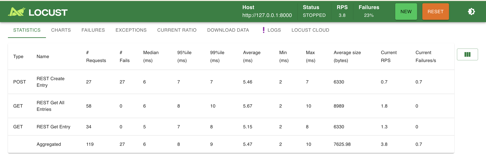
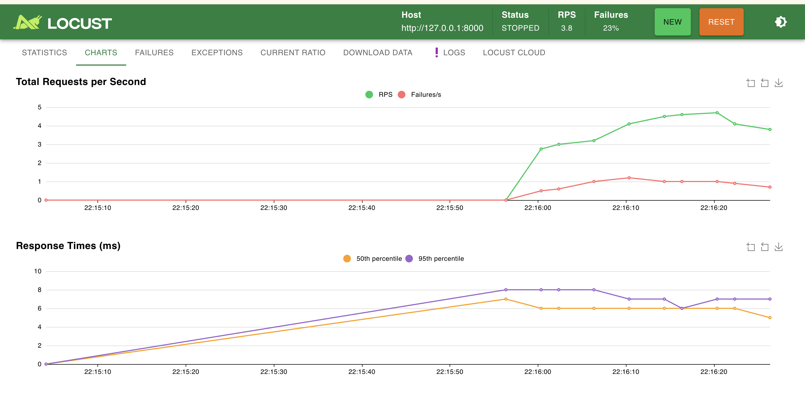

#### Рабочая нагрузка
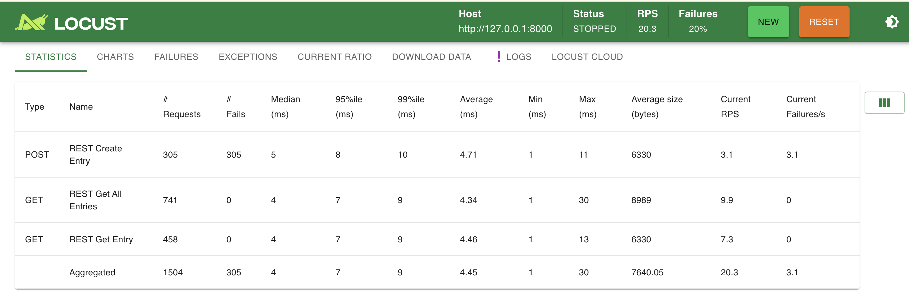
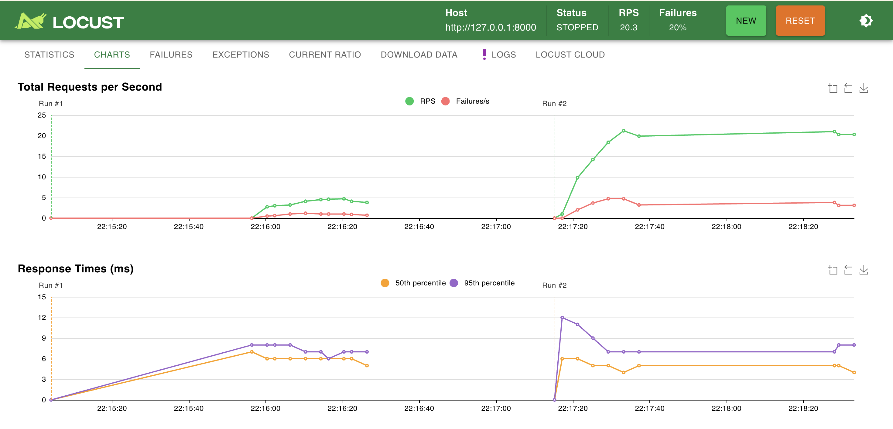

#### Стресс-тест
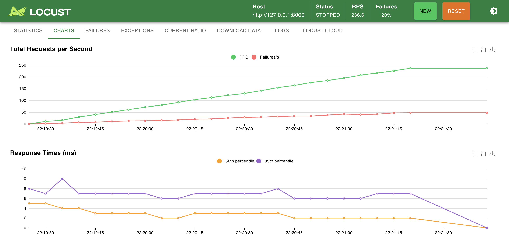
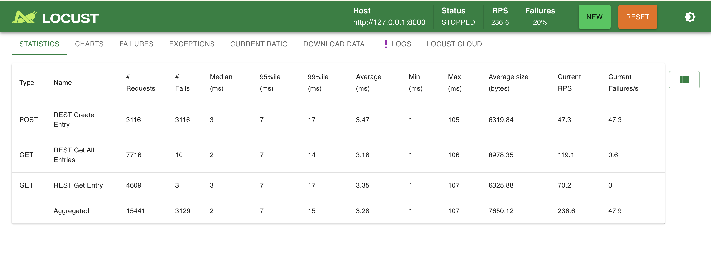

#### Тест на стабильность
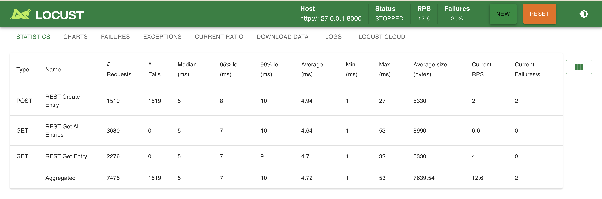
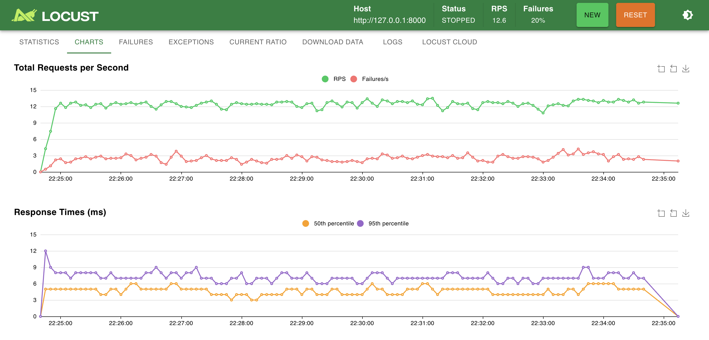

### gRPC API

#### Лёгкая нагрузка

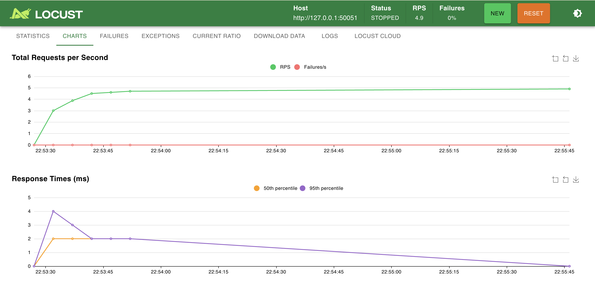

#### Рабочая нагрузка
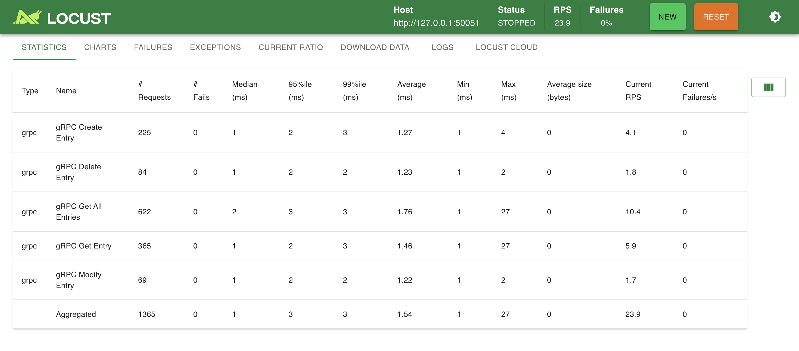
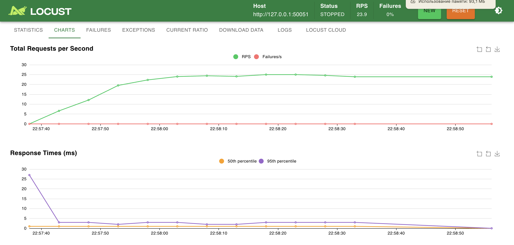

#### Стресс-тест
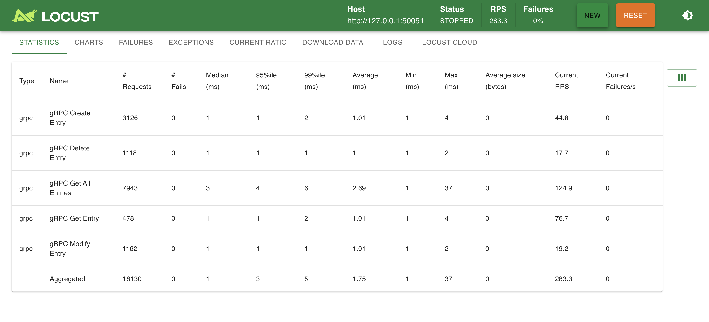
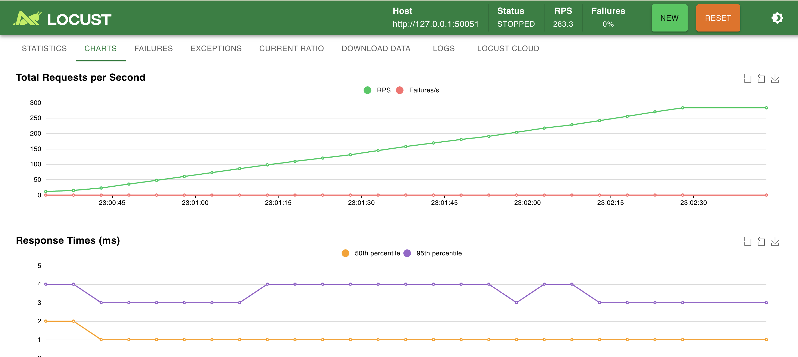

#### Тест на стабильность
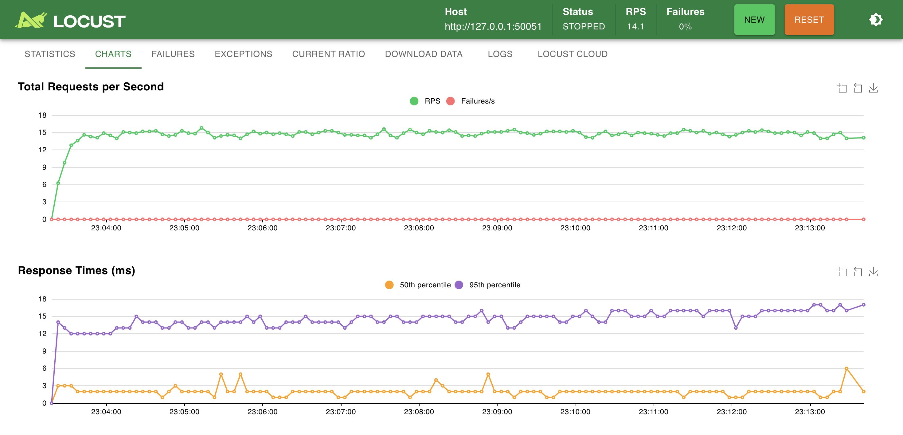
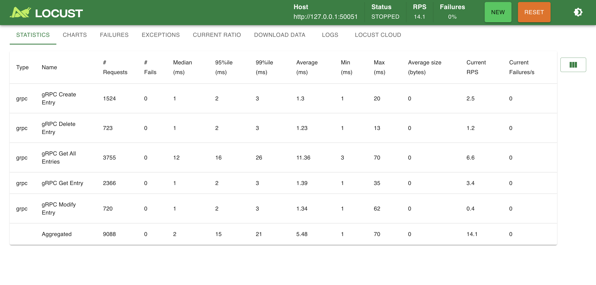

### Выводы о применимости

**Когда выбирать REST:**
- Для быстрой разработки и прототипирования
- Для публичных API
- Для интеграции с веб-приложениями
- Если нагрузки не слишком высокие

**Когда выбирать gRPC:**
- Для микросервисной архитектуры
- Для внутренней коммуникации между сервисами
- Если важна высокая производительность
- Для строгой типизации API

### Основные выводы

### Возможные улучшения эксперимента

1. Использовать базу данных вместо in-memory хранилища
2. Организовать распределённое тестирование на разных машинах
3. Внедрить мониторинг ресурсов (CPU, RAM, сеть)
4. Тестировать с различными объёмами данных

### Ограничения проведённого тестирования

1. Все компоненты работают на одном устройстве (нет сетевых задержек)
2. Нет учёта внешних факторов (потери пакетов, DNS)
3. Искусственный характер нагрузки
4. Отсутствие базы данных
5. In-memory хранилище может приводить к утечкам памяти

### Исследовательская задача
1. "Performance Evaluation of REST, GraphQL, and gRPC in Microservices Architectures"
2. Benchmarking GraphQL vs REST vs gRPC: A Network Efficiency Perspective
